# PE1 - Project Exam 1

Responsive front-end web application for an e-commerce platform. Users can view products (with descriptions, prices, ratings, and reviews), register, log in, purchase products (when logged in), and log out after checkout. Integrates with an existing e-commerce API.

---

## 📸 Screenshot

Below you can see screenshots of the main pages and features for the e-commerce website, shown in both desktop and mobile views. (Sizes on mobile images are for readability).

### Homepage

**Desktop:** 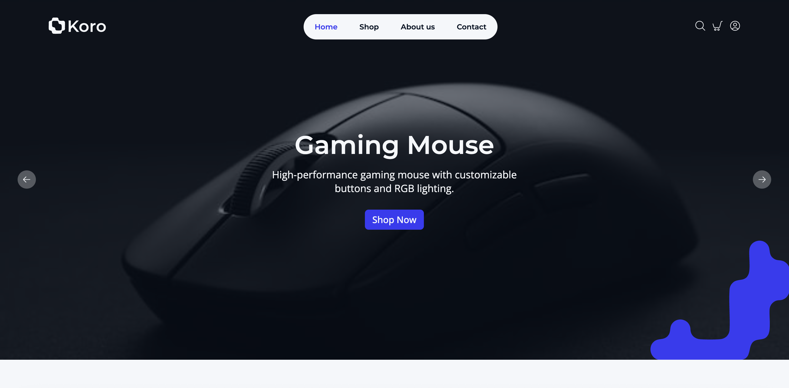

**Mobile:** 

### Product List

**Desktop:** 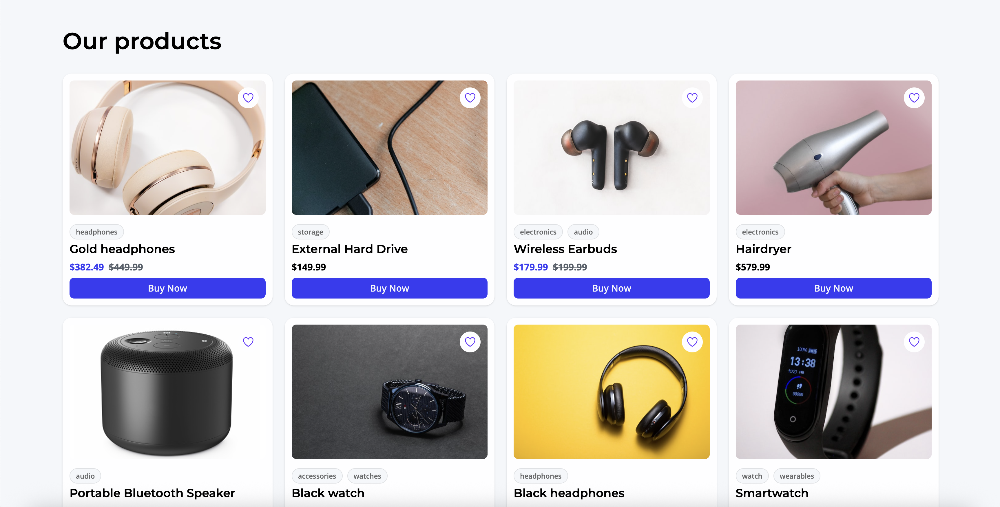

### Product Page

**Desktop:** 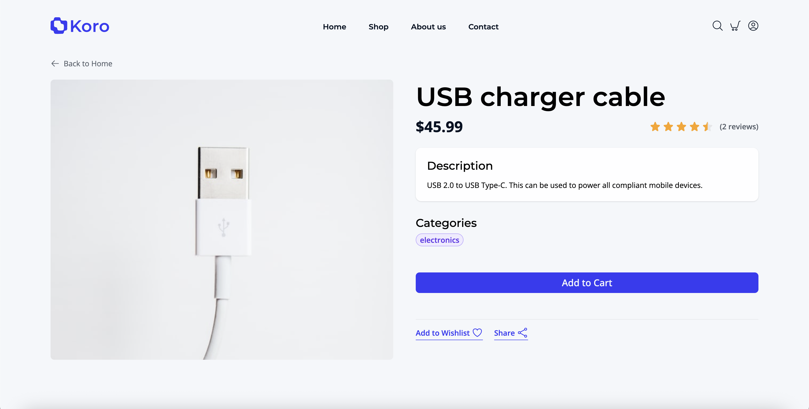

**Mobile:** 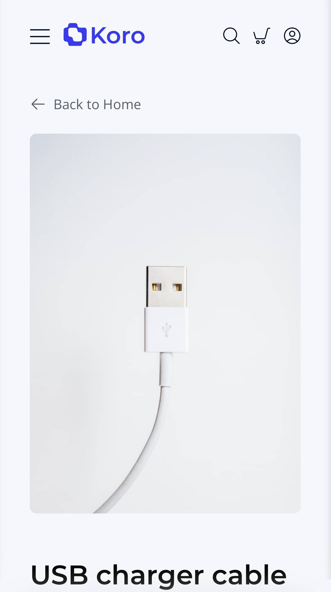

### Cart Page

**Desktop:** 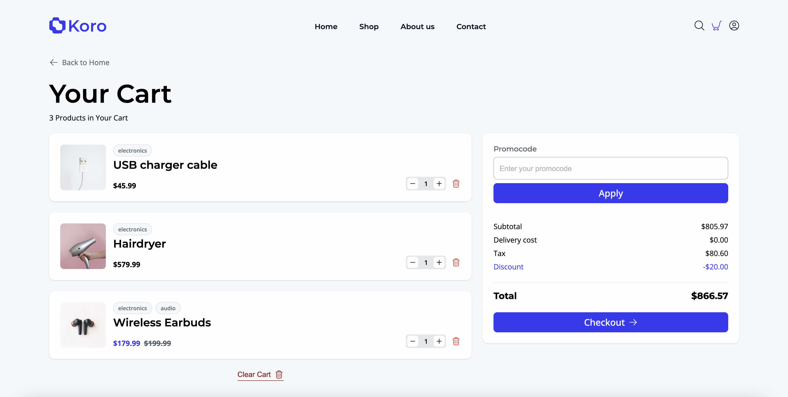

**Mobile:** 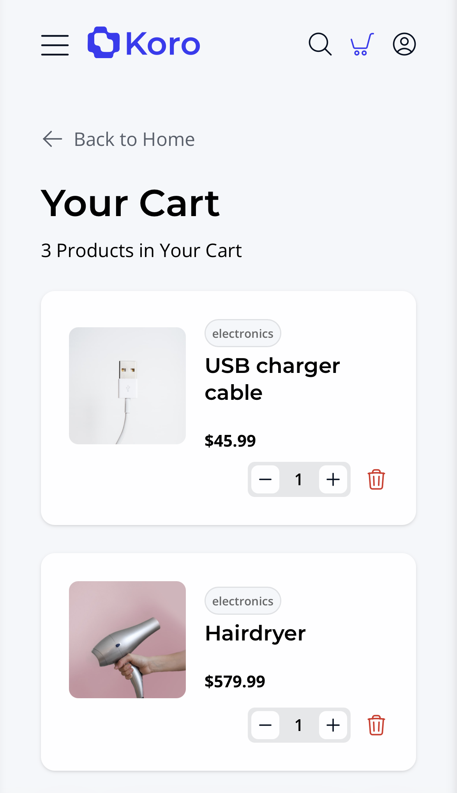

### Checkout Page

**Desktop:** 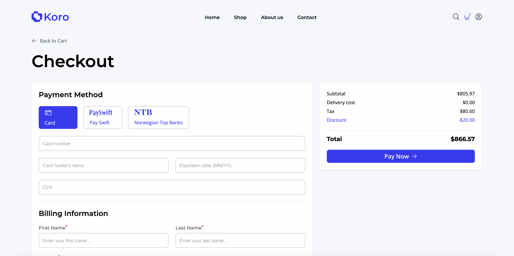

### Order Success Page

**Desktop:** 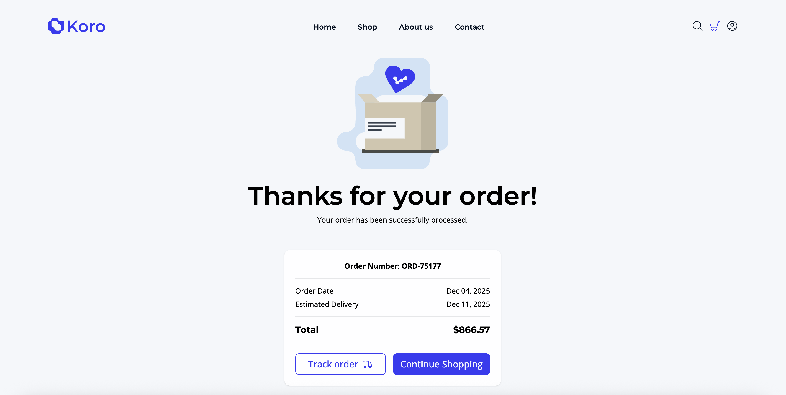

### Login Page

**Desktop:** 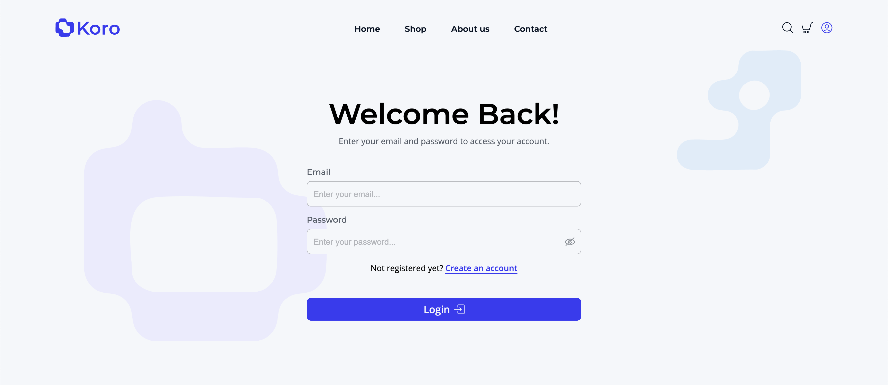

**Mobile:** 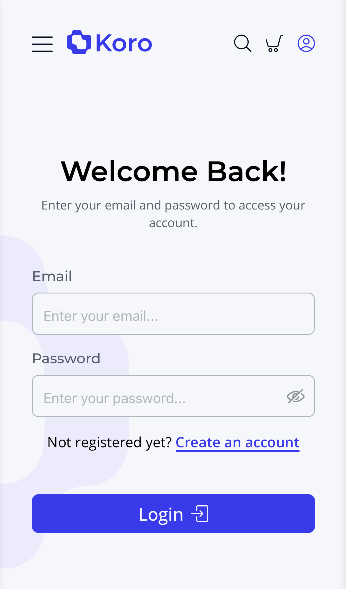

### Profile Page

**Desktop:** 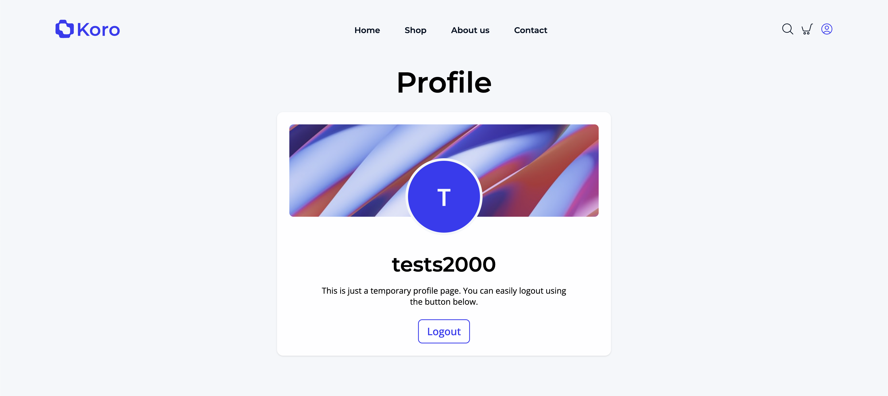

---

## 🛠️ Built With

Main tools and technologies used in this project:


---

## 📦 Installation

Follow these steps to get a copy of the project running locally:

1. Clone the repository:

   ```bash
   git clone https://github.com/helenesyre/PE1-helene-syre.git
   ```

2. Open the repository:

   ```bash
     cd PE1-helene-syre
   ```

3. Run Local Server

   Install dependencies and start the development server:

   ```bash
   npm install
   npm run dev
   ```

> Note: Used Prettier code formatter for formating of files. If some of the indentation looks of, its because of the auto-formating done by Prettier.

## License

MIT License

## Contact

Helene Syre - [@syre_design](https://www.instagram.com/syre_design/) - syrehelene@gmail.com

Project Link: [https://helenesyre.github.io/PE1-helene-syre/](https://helenesyre.github.io/PE1-helene-syre/)
